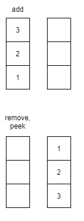

# Queue
FIFO(선입선출)

#### 두개의 스택으로 Queue만들기
   

add 동작 실행시 data 담을 stack과 peek나 remove 시 보여줄 데이터를 담을 stack을 사용한다.   
편의상 전자는 new 후자는 old라고 함
* 그림이 허접한데 첫번째 처럼 add할때는 new에 데이터를 push한다.
* remove나 peek을 할때는 두번째 그림처럼 new에 있는 모든 data를 old로 이동 후  
* old에 pop을 실행시켜서 마지막 데이터를 가져온다
  - 단, remove나 peek할 때 old가 비어있지 않다면 new에서 데이터 옮기면 안됨 
